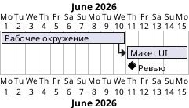

# План проекта

## 1. Введение

### 1.1. Определения и сокращения

>Определения всех терминов, сокращений и аббревиатур, необходимых для правильной интерпретации содержимого документа. Эта информация может быть предоставлена посредством ссылки на "Глоссарий" проекта.

### 1.2. Ссылки
План проекта является главным документом, поэтому различные его разделы будут детально раскрываться в других документах:

- [План управления требованиями](./requirements_management_plan.md)
- [План управления качеством](./quality_assurance_plan.md)
- [План управления рисками](./risk_management_plan.md)
- [План тестирования](./test_plan.md)
- [План измерений](./measurements_plan.md)
- [План сборки](./build_plan.md)
- [План развертывания](./deployment_plan.md)
- [План приемки](./acceptance_plan.md)

## 2. Обзор проекта

### 2.1. Цель, сфера и задачи проекта
> Краткое описание общей цели и задач этого проекта, краткое описание ожидаемых результатов проекта.
 
### 2.2. Допущения и ограничения
> Список предположений, на которых основывается проект и любых ограничений, которые также относятся к проекту (бюджет, персонал,
оборудование, график).

### 2.3. Результаты проекта
> Список артефактов в виде таблицы, которые должны быть созданы во время работы над проектом, включая даты поставки релизов.
> Список должен быть представлен в виде ссылок на опубликованные в репозитории артефактов, чтобы можно было в любой момент найти результаты проекта.

| № | Артефакт | Дата поставки | Важность | Комментарии |
|---|----------|---------------|----------|-------------|
|   |          |               |          |             |

## 3. Организация проекта

### 3.1. Организационная структура
> Организационная структура команды проекта, включая руководство и другие контрольные органы.
> Здесь стоит описать все, что касается подхода к организации и зависимостям между проектными командами, как и по какому принципу выделяются команды и т.п.

TODO

### 3.2. Внешние контакты
> Описание того, как происходит взаимодействие с внешними персонами и группами. Для каждой внешней группы следует указать внутренние и
внешние имена контактов.
> Логично перечислить здесь все внешние контакты, которые могут понадобиться при работе над проектом.

TODO

### 3.3. Роли и обязанности
> Перечень ролей в проекте, отвечающих за каждую из дисциплин, а так же детали рабочего процесса и вспомогательные процессы.

| Проектная роль       | Обязанности                                                         | Комментарии |
|----------------------|---------------------------------------------------------------------|-------------|
| `Project Owner`/`PO` | Отвечает за весь проект, планирование, бюджет, управление ресурсами |             |

### 4. Процесс управления

### 4.1. Оценки и смета проекта
> Сметная стоимость и график проекта, а также обоснование этих оценок, а также точки принятия решений и обстоятельства в проекте, когда
произойдет переоценка.
> Можно сослаться на внешние документы, но краткая выдержка из них должна быть добавлена в этот раздел.

### 4.2. План проекта

#### 4.2.1. Поэтапный план

>- Структура этапов работ.
>- График распределения времени или диаграмма Ганнта, показывающие распределение времени по фазам или итерациям проекта.
>- Основные этапы проекта с критериями их достижения.

TODO

#### 4.2.2. Цели итераций

> Перечисление конкретных целей каждой из итераций.
> Заранее трудно составить такой план, но стоит периодически обновлять этот раздел по результатам SCRUM-планирования, чтобы была понятна динамика.

| Система/модуль | Спринт | Комментарий |
|----------------|--------|-------------|
| TODO           |        |             |

#### 4.2.3. Релизы

> Краткое описание каждого выпуска программного обеспечения: демо в конце итерации, альфа, бета, т.п.

| Релиз | Планируемая дата | Описание | Комментарий |
|-------|------------------|----------|-------------|
| TODO  |                  |          |             |

#### 4.2.4. Расписание проекта
> Диаграммы или таблицы с указанием целевых дат завершения итераций и фаз, релизов, демонстраций и других этапов.

#### 4.2.5. Ресурсы проекта

##### 4.2.5.1. Штатное расписание
> Указать количество и тип необходимого персонала, включая любые специальные навыки или опыт, запланированные на этапе проекта или
итерации.

| Роль | Требования и ограничения | Комментарии |
|------|--------------------------|-------------|
| TODO |                          |             |

##### 4.2.5.2. План по приобретению ресурсов
> Описать критерии и методы поиска и найма необходимого для проекта персонала.
> Сюда следует приложить инструкции по подбору персонала для нетипичных ролей.

TODO

##### 4.2.5.3. План обучения
> Перечисление видов специальной подготовки, курсов, лекций и т.п. для различных членов команды проекта с указанием сроков окончания обучения.

TODO

##### 4.2.6. Бюджет
> Распределение затрат по основным этапам проекта.

TODO

### 4.3. Планы итераций
> Каждый итерационный план должен быть включен в этот раздел в виде ссылки.

TODO

### 4.4. Мониторинг и контроль проекта

#### 4.4.1. План управления требованиями
Описание принципа, по которому выявляются, описываются, фиксируются, приоритизируются требования (ФТ и НФТ) в проекте,
описаны в отдельном документе [План управления требованиями](./requirements_management_plan.md).

#### 4.4.2. План управления расписанием
> Описание подхода, который необходимо применить для мониторинга прогресса относительно запланированного графика работ и какие корректирующие действия предпринять при необходимости.

#### 4.4.3. План бюджетного контроля
> Описание подхода к учету расходов относительно бюджета проекта и способы принятия корректирующих мер при необходимости.

#### 4.4.4. План контроля качества
> Перечисление методы и контрольных сроков, которые будут использоваться для контроля качества результатов проекта и как при необходимости предпринять корректирующие действия.
> В разделе содержатся только ключевые методы, а все детали находятся в документе [План обеспечения качества](./quality_assurance_plan.md).

TODO

#### 4.4.5. План отчетности
> Описание внутренних и внешних отчетов, которые будут генерироваться в проекте, а также частоту и принципы распространение публикаций этих отчетов.

#### 4.4.6. План измерений
> Перечисление методов для измерения важных проектных показателей:
функциональных, нефункциональных, бюджетных и календарных требования и ограничения, которые необходимо отслеживать.
> В разделе содержатся только ключевые методы, а все детали находятся в документе [План измерений](./measurements_plan.md)

TODO

### 4.5. План управления рисками
Методика работы с проектными рисками приведена в отдельном документе [План управления рисками](./risk_management_plan.md).

### 4.6. План закрытия
> Перечень и описание мероприятий по упорядоченному завершению проекта, включая переназначение персонала, архивирование материалов
проекта, ретроспективу и т.п.

## 5. Планы технического процесса

### 5.1. Инструкции по разработке
> Инструкции, используемые основными проектными ролями:
>
>- Служебная инструкция Роли1

### 5.2. Методы, инструменты и приемы
> Перечисление документов, описывающих технические стандарты проекта, включая:
>
> - Инструкция по сбору требований
> - Инструкция по моделированию требований
> - Руководство по проектированию пользовательского интерфейса
> - Инструкция по системному дизайну
> - Инструкция по программированию
> - Руководство по стилю кодирования
> - Инструкция по тестированию
> - Инструкция по развертыванию

### 5.3. План инфраструктуры
TODO

### 5.4. План приемки продукта
> Описание мероприятий и этапов, которые необходимо выполнить для успешного прохождения приемо-сдадочных испытаний продукта.
> Детали должны быть описаны в [План приемки](./acceptance_plan.md).

## 6. Планы поддерживающих процессов
TODO

### 6.1. План управления конфигурацией
TODO

### 6.2. План оценки
> Описание планов по оценке продукта, охватывающих методы, критерии, метрики и процедуры, используемые для оценки: 
> пошаговые руководства, проверки и обзоры. 
> Более подробно эти планы должны быть описаны в [Плане тестирования](./test_plan.md).

### 6.3. План документирования
TODO

### 6.4. План обеспечения качества
> Описание планов и мероприятий по реализации требований к качеству продукта.
> В разделе содержатся только основные тезисы, 
> а все детали находятся в документе [План обеспечения качества](./quality_assurance_plan.md)

TODO

## 7. Дополнительные планы
> Дополнительные планы, если это требуется согласно контракту или внутренним правилам.

## 8. Приложения
> TODO
